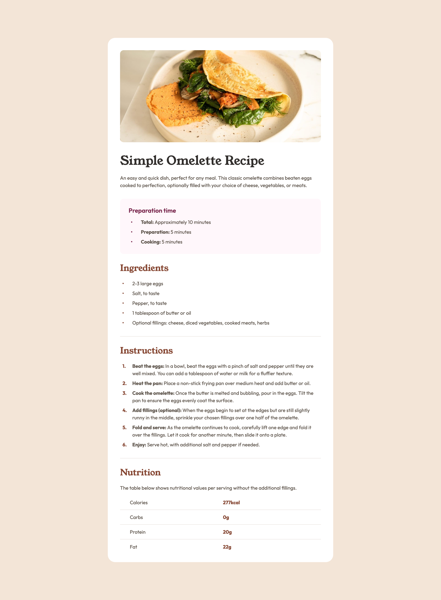
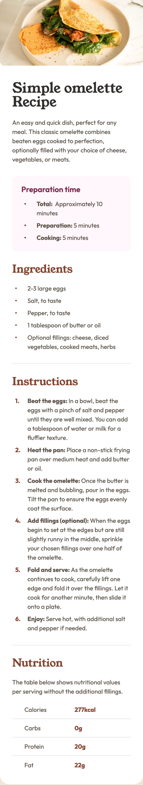

# Frontend Mentor - Recipe page solution

This is a solution to the [Recipe page challenge on Frontend Mentor](https://www.frontendmentor.io/challenges/recipe-page-KiTsR8QQKm). Frontend Mentor challenges help you improve your coding skills by building realistic projects.

## Table of contents

- [Overview](#overview)
  - [The challenge](#the-challenge)
  - [Screenshot](#screenshot)
  - [Links](#links)
- [My process](#my-process)
  - [Built with](#built-with)
  - [What I learned](#what-i-learned)
- [Author](#author)

## Overview

### Screenshot




### Links

- Solution URL: [solution URL](https://github.com/jaceleedev/recipe-page)
- Live Site URL: [live site URL](https://jaceleedev.github.io/recipe-page/)

## My process

### Built with

- HTML5
- CSS3
- Figma Design

### What I learned

리스트들이 많이 나왔는데, 텍스트들을 디자인대로 간격을 맞추는 것이 까다로웠다. 모바일 사이즈에서도 자연스럽게 열이 맞아야 하는데, 뷰포트를 줄이다보면 자연스럽게 나와야 하는 레이아웃이었다. 처음에는 어떻게 할지 몰라서 여러가지 시도를 하다가, span 태그를 활용해 해결할 수 있었다.

```html
<li>
  <span class="bullet"></span>
  <span>
    <span class="strong">Total:&nbsp;</span>
    Approximately 10 minutes
  </span>
</li>
```

이렇게 span으로 묶어주면, 디자인에서 요구하는대로 정확하게 텍스트가 출력되었다.

또, 리스트의 bullet point와 number를 직접 만들어서 사용했는데, width를 16px로 설정했지만
실제로 width값이 제대로 적용되지 않는 문제가 있었다. 이것은 min-width를 적용했더니 완벽하게 해결되었다.

```css
.preparation-time > ul > li > .bullet {
  position: relative;

  min-width: 16px;
  height: 24px;
  margin-right: 16px;
}
```

이번에는 공통적으로 적용되는 css 부분이 많았는데, 속도를 내서 진행하다보니 최적화가 잘 되지는 않았다.
더 복잡하고 페이지 숫자가 많아질수록, 디자인을 자세히 보고 공통을 미리 만들어두는 것이 좋아보인다.

## Author

- Website - [jaceleedev](https://github.com/jaceleedev)
- Frontend Mentor - [@jaceleedev](https://www.frontendmentor.io/profile/jaceleedev)
