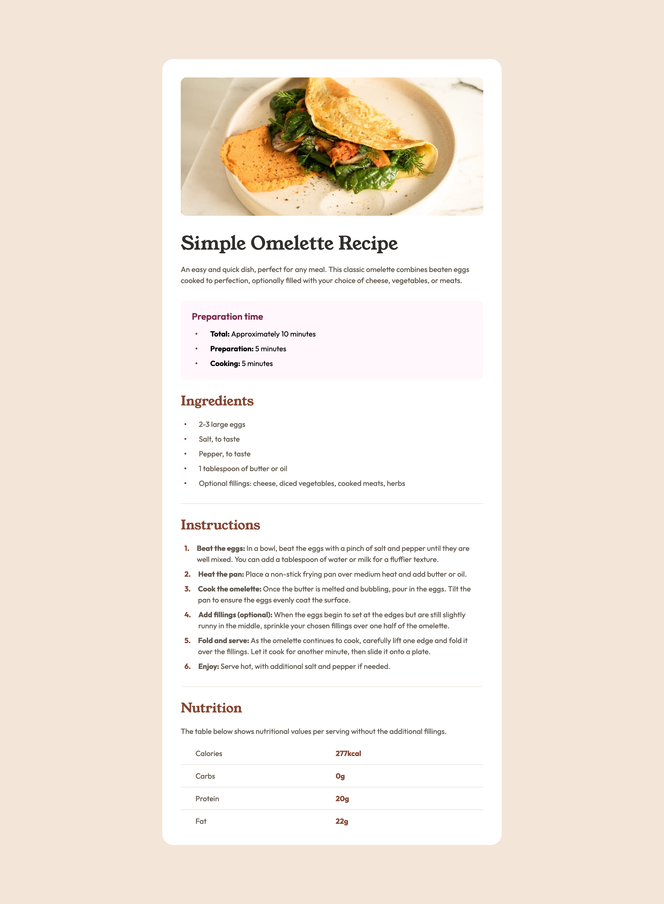
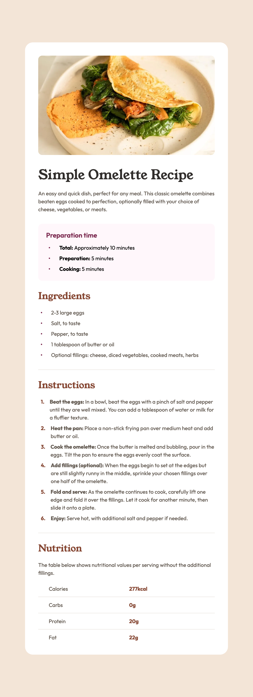

# Frontend Mentor - Recipe page solution

This is a solution to the [Recipe page challenge on Frontend Mentor](https://www.frontendmentor.io/challenges/recipe-page-KiTsR8QQKm). Frontend Mentor challenges help you improve your coding skills by building realistic projects.

## Table of contents

- [Overview](#overview)
  - [The challenge](#the-challenge)
  - [Screenshot](#screenshot)
  - [Links](#links)
- [Getting Started](#getting-started)
  - [Prerequisites](#prerequisites)
  - [Installation](#installation)
- [My process](#my-process)
  - [Built with](#built-with)
  - [What I learned](#what-i-learned)
  - [Continued development](#continued-development)
  - [Useful resources](#useful-resources)
- [Author](#author)

## Overview

### The challenge

Users should be able to:

- View the optimal layout depending on their device's screen size

### Screenshot





### Links

- Solution URL: [https://www.frontendmentor.io/solutions/recipe-page-with-nextjs-tailwind-css-jGP0-AZI5R]
- Live Site URL: [https://recipe-page-nine-pi.vercel.app/]

## Getting Started

To get a local copy up and running follow these simple steps:

### Prerequisites

Make sure you have the following software installed on your machine:

- [Node.js](https://nodejs.org/) (Node.js 18.17 or later)
- [pnpm](https://pnpm.io/)

### Installation

1. Clone the repository:

   ```sh
   git clone https://github.com/jaceleedev/recipe-page.git
   ```

2. Navigate to the project directory:

   ```sh
   cd recipe-page
   ```

3. Install dependencies using pnpm:

   ```sh
   pnpm install
   ```

4. Start the development server:

   ```sh
   pnpm dev
   ```

5. Open your browser and visit http://localhost:3000 to view the project.

## My process

### Built with

- Next.js (v14.2.5)
- TypeScript (v5)
- Tailwind CSS (v3.4.1)
- CSS Grid
- Semantic HTML5 markup
- SEO & web accessibility

### What I learned

During this project, I learned about the potential performance issues of overusing @apply in CSS Modules with Tailwind CSS, especially in large-scale projects. Initially, I used @apply in CSS Modules for better readability:

```css
.button {
  @apply py-2 px-4 bg-blue-500 text-white rounded hover:bg-blue-600;
}
```

However, I discovered that excessive use of @apply can lead to performance degradation in larger projects. Instead, I adopted the approach of using Tailwind classes directly in components:

```jsx
function Button() {
  return (
    <button className="py-2 px-4 bg-blue-500 text-white rounded hover:bg-blue-600">
      Click me
    </button>
  );
}
```

This approach maintains the advantages of Tailwind CSS, such as easier maintenance and smaller CSS bundle sizes.

### Continued development

While Tailwind CSS is powerful, there may be situations where it's challenging to achieve complex designs solely with utility classes. In such cases, I'll consider using CSS Modules for more fine-grained control over styles.
Additionally, I want to improve the readability of my components by creating smaller, reusable components for elements that are used frequently. This aligns with the Tailwind CSS documentation's recommendation:

```jsx
function PrimaryButton({ children }) {
  return (
    <button className="py-2 px-4 bg-blue-500 text-white rounded hover:bg-blue-600">
      {children}
    </button>
  );
}

// Usage
<PrimaryButton>Click me</PrimaryButton>;
```

This approach will help maintain cleaner and more manageable code in larger projects.

### Useful resources

- [Next.js Documentation](https://nextjs.org/docs) - Comprehensive guide to Next.js features and API.
- [Tailwind CSS Documentation](https://tailwindcss.com/docs/installation) - Detailed documentation for Tailwind CSS.
- [A Complete Guide to CSS Grid](https://css-tricks.com/snippets/css/complete-guide-grid/) - Comprehensive guide to CSS Grid.

## Author

- GitHub - [@jaceleedev](https://github.com/jaceleedev)
- Frontend Mentor - [@jaceleedev](https://www.frontendmentor.io/profile/jaceleedev)
